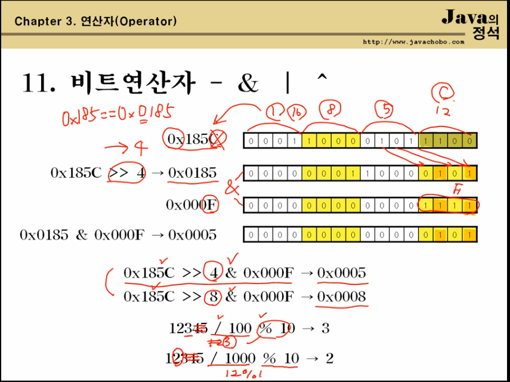

## Ch3. Java의 정석 연산자

### 1. 연산자란?

- 연산자(Operator)
  - 어떠한 기능을 수행하는 기호 ( +, - , *, / 등)

- 피연산자(Operand)
  - 연산자의 작업 대상 ( 변수, 상수, 리터럴, 수식)


### 2. 연산자의 종류

- 단항 연산자: 피연산자 한 개인 경우 ( +, - , ~ , ++, --, !) 우선순위가 가장 높다.

- 이항 연산자: 산술, 비교, 논리 (&&, ||, &, ^, |)

- 삼항 연산자: ? :
- 대입 연산자 : = (모든 연산이 끝난 후 계산한다, 즉 우선 순위가 가장 낮다.)


### 3. 연산자의 우선순위

- 괄호의 우선순위가 제일 높다.
- 산술 > 비교 > 논리 > 대입
- 연산자의 연산 진행방향은 왼쪽에서 오른쪽이다.
- 단, 단항, 대입 연산자만 오른쪽에서 왼쪽이다.


- 그러나 몇 가지 주의해야 할 것이 있다.
  1. <<, >>, >>>(쉬프트 연산자)는 덧셈연산자보다 우선순위가 낮다.	
  2. ||, |(OR)는 &&, &(AND) 보다 우선순위가 낮다.


### 4. 증감연산자 ++, --

| 전위형 | j = ++i; | ++i;    j = i; | 값이 참조되기 전에 증가시킨다. |
| ------ | -------- | -------------- | ------------------------------ |
| 후위형 | j = i++; | j = i;    i++; | 값이 참조된 후에 증가시킨다.   |


### 5. 부호연산자(+, -)와 논리부정연산자(!)

- 부호연산자(+, -): '+'는 피연산자에 1을 곱하고 '-'는 피연산자에 -1을 곱한다.
- 논리부정연산자(!): true는 false로, false는 true로 피연산자가 boolean일 때만 사용가능


### 6. 비트전환연산자 ~

- 정수를 2진수로 표현했을 때, 1을 0으로 0은 1로 바꾼다.
- 정수형에만 사용가능


### 7. 이항연산자의 특징

이항연산자는 연산을 수행하기 전에 피연산자의 타입을 일치시킨다.

- int보다 크기가 작은 타입은 int로 변환한다.

  (byte, char, short -> int)

- 피연산자 중 표현범위가 큰 타입으로 형변환 한다.

  byte + short -> int + int -> int

  char + int -> int + int -> int

  float + int -> float + float -> float

  long + float -> float + float -> float

  long이 8byte이고 float가 4byte이지만 실수인 float가 표현범위가 더 넓어서 float로

  float + double-> double + double -> double


int a = 1000000;

int b = 2000000;

long c = a * b; // 오버플로우가 발생하여 잘못된 값이 들어간다.

이걸 막기 위해

long c = (long)a * b;

long * int -> long * long -> long


char c1 = 'a'; // 유니코드로 97

char c2 = c1 + 1; // 에러

char c2 = (char)(c1 +1); // OK  // c2 = '98'  

char c2 = ++c1; // OK  위에 식과 같은 식 즉 증감연산자가 효율적으로 쓰인다.

int i = 'B' - 'A';  유니코드로 66 - 65로 i = 1; 정수가 저장된다.

int i = '2' - '0'; i = 2; 정수가 저장된다.


float pi = 3.141592f;

float shortPi = (int)(pi * 1000) / 1000f;

​			  (int)(3.141592f * 1000) / 1000f;

​			  (int)(3141) / 1000f;

​				3141 / 1000f;

​				3141.0f / 1000f;

​				3.141f이 된다.


Math.round() : 소수점 첫째자리에서 반올림한 값(정수) 을 반환


### 8. 나머지 연산자 %

- 나누기한 나머지를 반환한다.


### 9. 쉬프트연산자 <<, >>, >>>

- 2 ** n 으로 곱하거나 나눈 결과를 반환한다.

- 곱셈, 나눗셈보다 빠르다. 

- x << n 은 x * 2 ** n 과 같다.

  x >> n 은 x / 2 ** n 과 같다.

  8 << 2 는 8 * 2**2 과 같다.

  8 >> 2 는 8 / 2**2 과 같다.


### 10. 비교연산자 > < >= <= == !=

- 피연산자를 같은 타입으로 변환한 후에 비교한다.

  결과 값은 true 또는 false 이다.

- 기본형(boolean제외)과 참조형에 사용할 수 있으나

  참조형에는 ==와 !=만 사용할 수 있다.

- 'A' != 65 -> 65 != 65 -> false

  10.0d == 10.0f -> 10.0d == 10.0d -> true

  0.1d == 0.1f -> 0.1d == 0.1d -> false 이다 !

  double d = (double)0.1f;

  System.out.println(d); // 0.10000000149011612 인 1억분의 1정도의 사소한 오차지만

  같은 값은 아니므로 false가 나오게 된다.

  따라서 d의 값과 f의 값을 비교할 경우 double을 float로 변환하고 비교하는게 안전!


### 11. 비트연산자 & | ^

- 피연산자를 비트단위로 연산한다.

  실수형(float, double)을 제외한 모든 기본형에 사용가능

- OR연산자(|) : 피연산자 중 어느 한 쪽 1일 때 1이다.

- AND연산자(&): 피연산자 양 쪽 모두 1일 때 1이다.

- XOR연산자(^):  피연산자가 서로 다를 때 1이다.




### 12. 논리연산자 && ||

- 피연산자가 반드시 boolean이어야 하며 연산결과도 boolean이다.

  &&가 || 보다 우선순위가 높다. 같이 사용되는 경우 괄호를 사용하자


### 13. 삼항연산자 ? :

- 조건식의 연산결과가 true이면 식1의 결과를 반환하고 false이면 식2의 결과를 반환

```
(조건식) ? 식1 : 식2
int x = -10;
int absX = x>=0 ? x: -x;
```


### 14. 대입연산자 =, op=

- 오른쪽 피연산자의 값을 왼쪽 피연산자에 저장한다.

  단, 왼쪽 피연산자는 상수가 아니어야 한다.
