## Ch9. Java.lang 패키지

### 1.1 Object클래스의 메서드

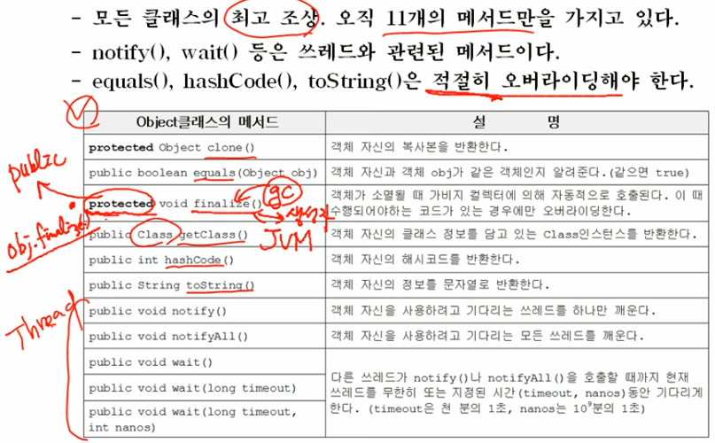

### 1.2 equals(Object obj)

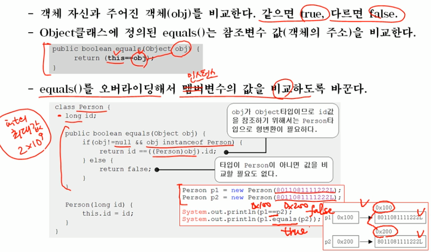

### 1.3 hashCode()

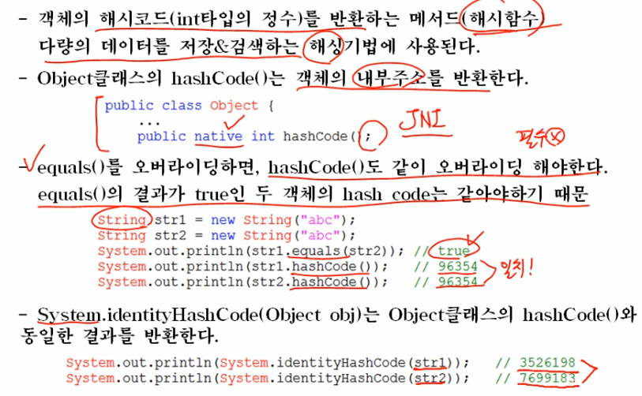

System.identiyHashCode(Object obj) 는 자주 사용하는 함수는 아니므로 이런 함수가 존재한다는 것만 짚고 넘어가자.

### 1.4 toString()

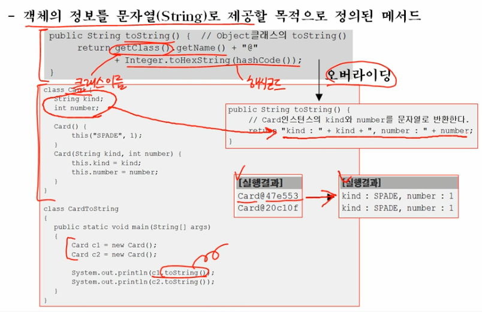

### 1.5 clone()

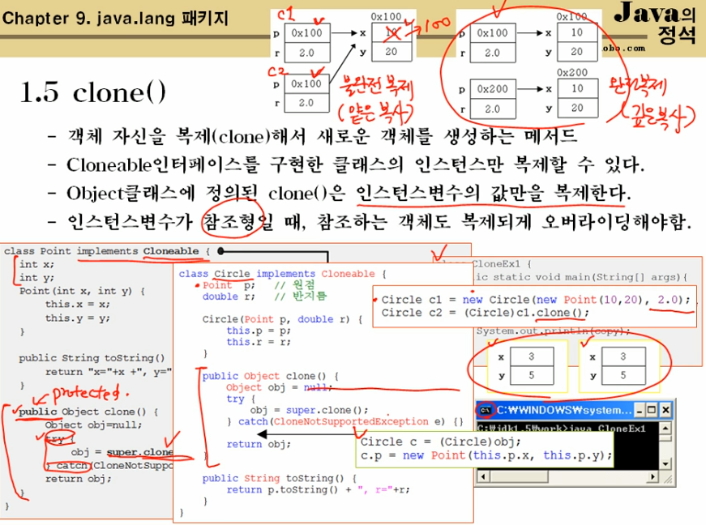

### 1.6 getClass()

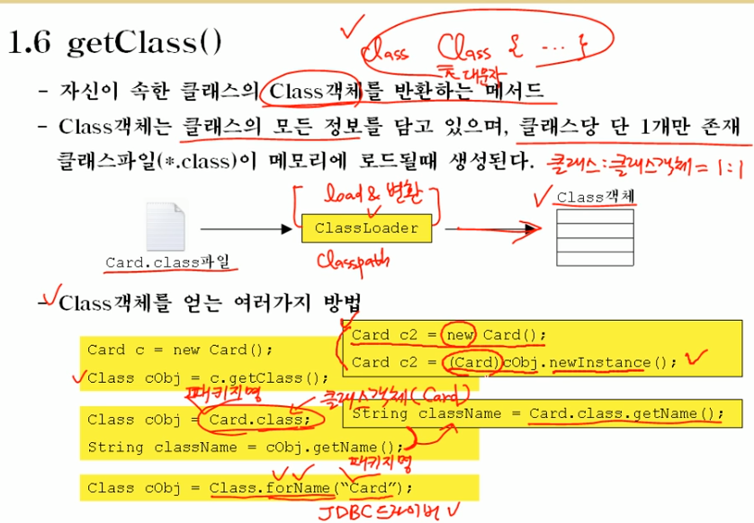

### 2.1 String클래스의 특징

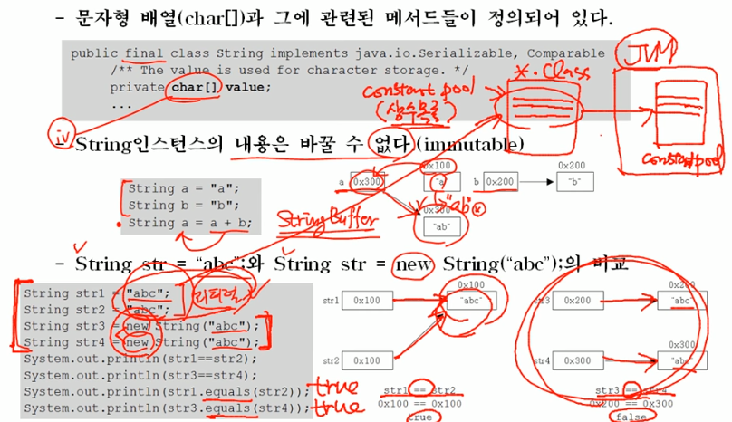

### 2.2 빈 문자열

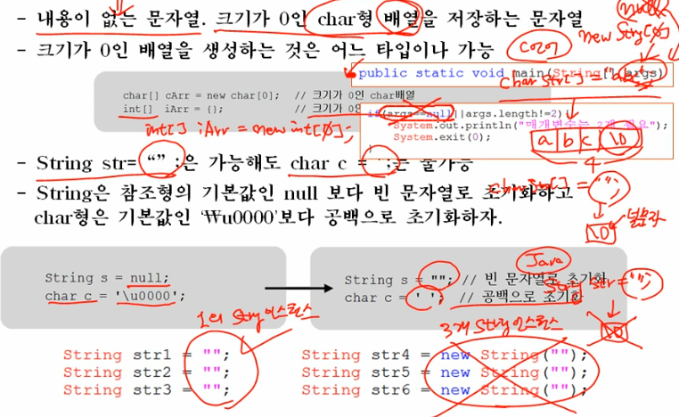

### 2.3 String클래스의 생성자와 메서드

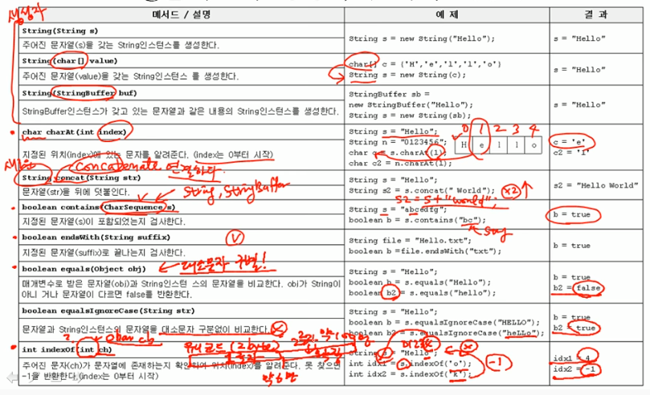

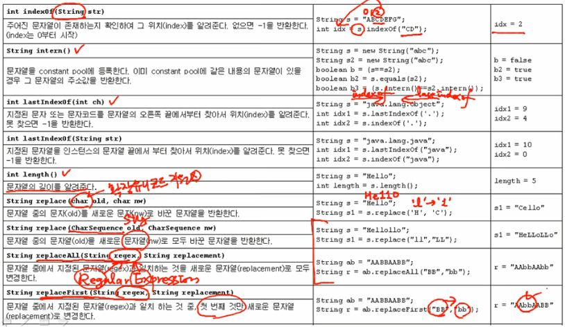

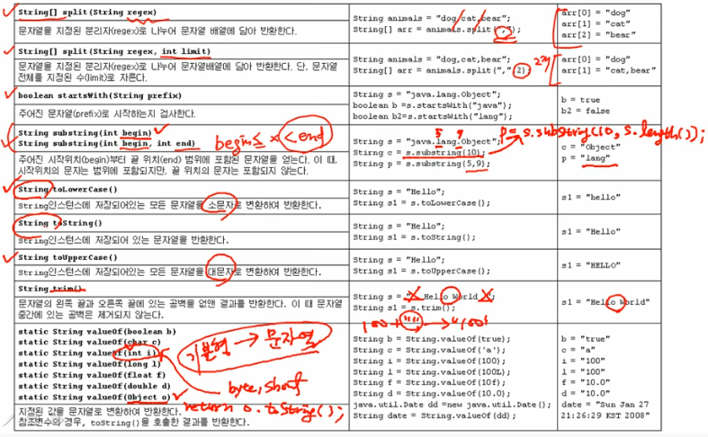

### 2.4 문자열과 기본형간의 변환

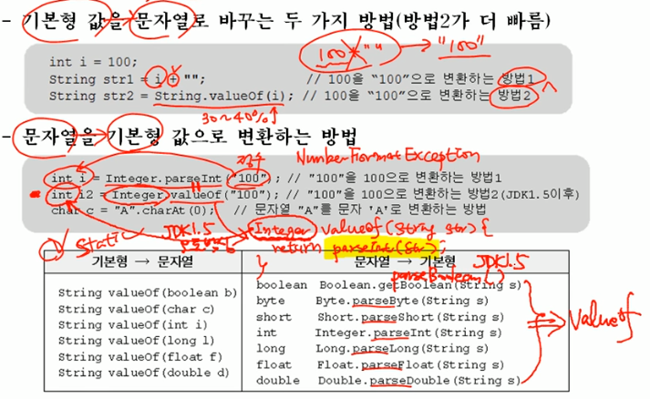

### 예제

 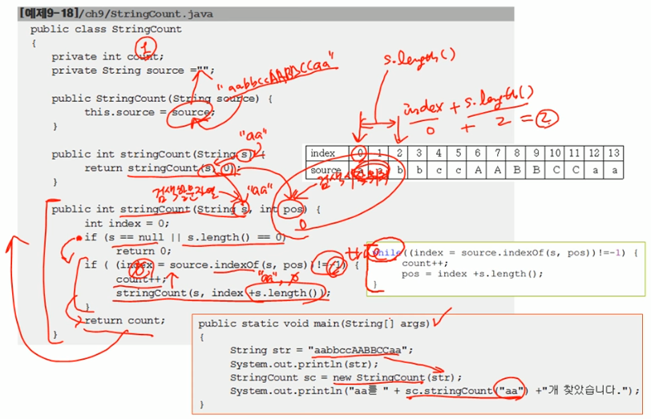

### 3.1 StringBuffer클래스의 특징

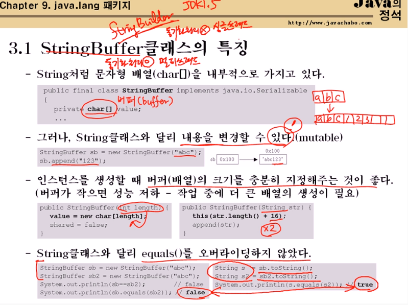

### 3.2 StringBuffer 클래스의 생성자와 메서드

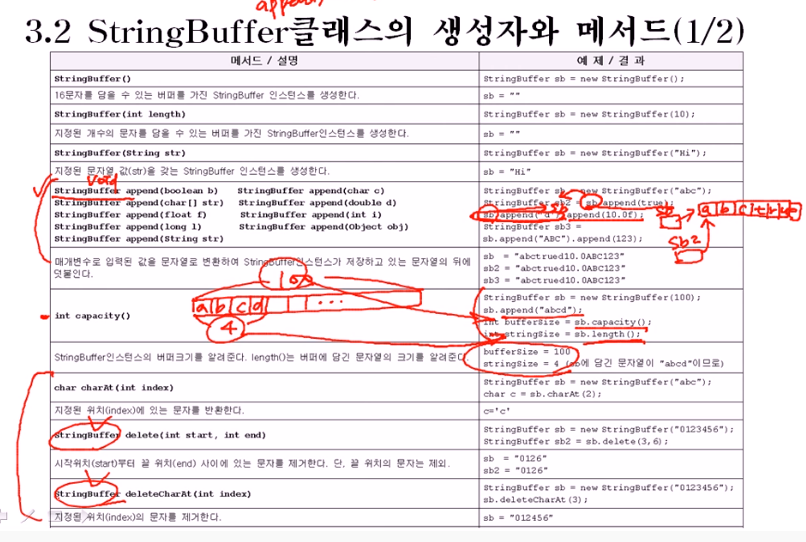

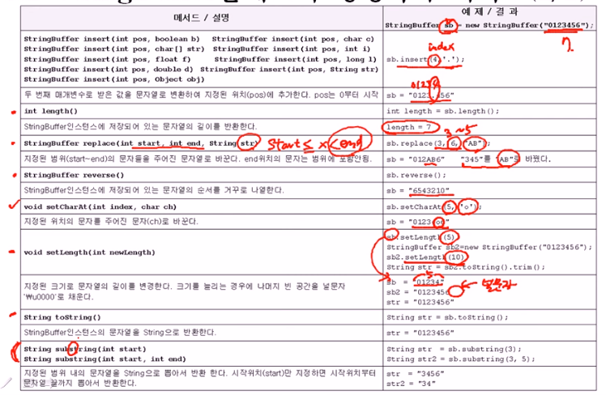

### 4.1 Math클래스

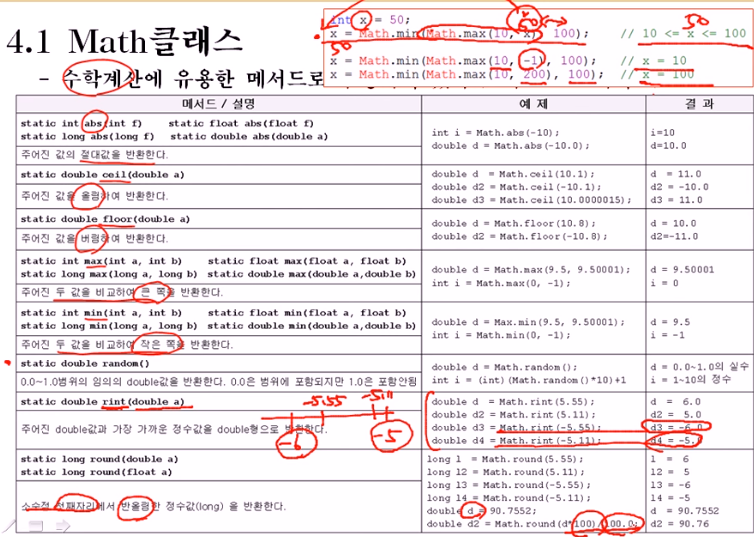

### 4.2 wrapper 클래스

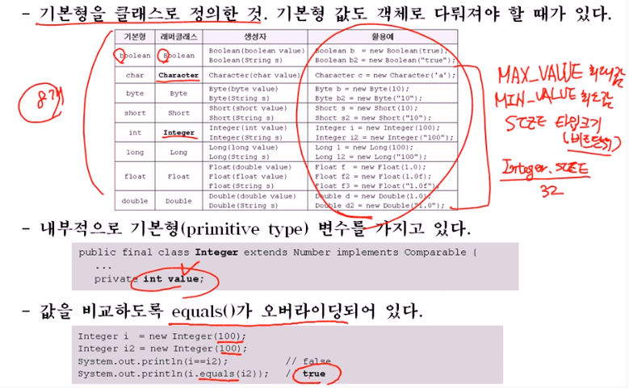

### 4.3 Number 클래스

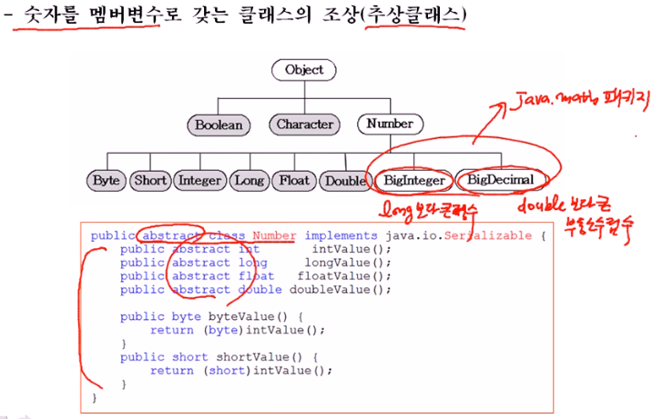

