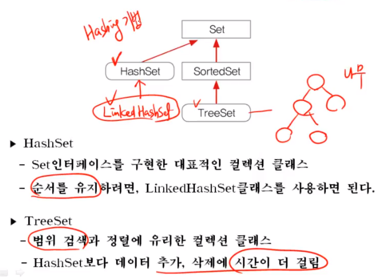
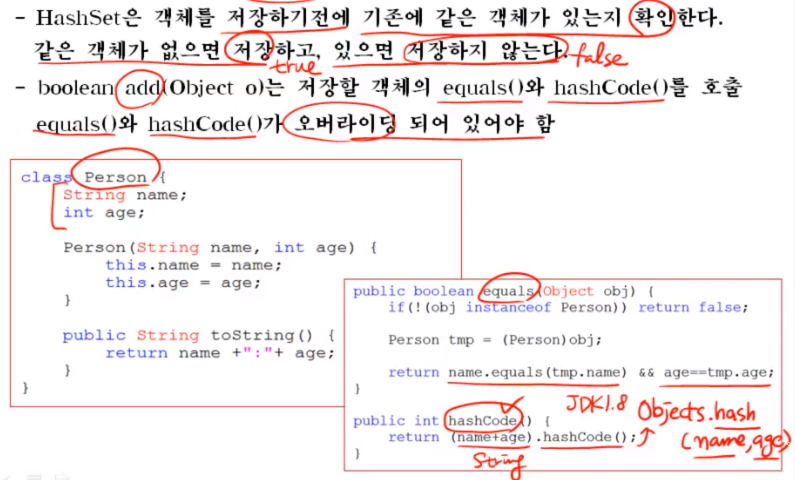
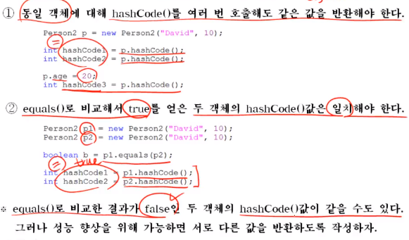
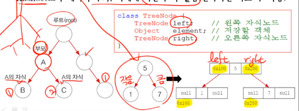
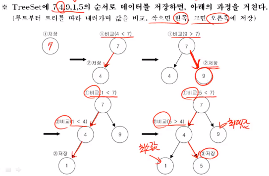
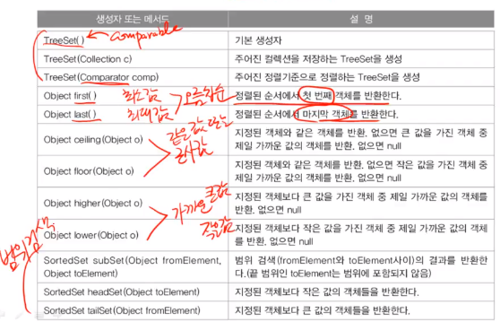
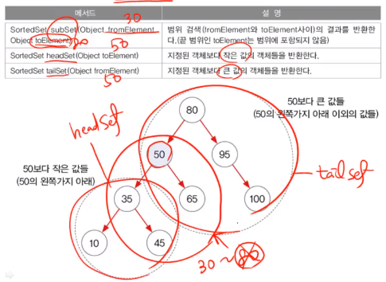
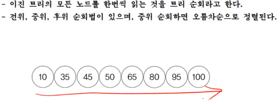

## Ch. 11-7 HashSet과 TreeSet

### 7.1 HashSet과 TreeSet

### 7.2 HashSet - boolean add(Object o)

### ctrl + shift + o 는 자동 import

###  7.3 HashSet - hashCode()의 오버라이딩 조건(JDK1.8 Objects.hash())

### 7.4 TreeSet - 범위 검색과 정렬에 유리

- 범위 검색과 정렬에 유리한 이진 검색 트리(binary search tree)로 구현 링크드 리스트처럼 각 요소(node)가 나무형태로 연결된 구조
- 이진 트리는 모든 노드가 최대 두 개의 하위 노드를 갖음(부모-자식관계)

- 이진 검색 트리는 부모보다 작은 값을 왼쪽에, 큰 값은 오른쪽에 저장

- HashSet보다 데이터 추가, 삭제에 시간이 더 걸림(반복적인 비교 후 저장)

### 7.5 TreeSet - 데이터 저장과정 boolean add(Object o) 중복x

### 7.6 TreeSet - 주요 생성자와 메서드

 

### 7.7 TreeSet - 범위 검색 subSet(), headSet(), tailSet()

### 7.8 TreeSet - 트리 순회(전위, 중위, 후위)

