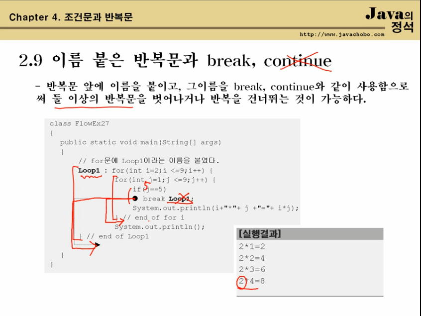

## Ch4. 조건문과 반복문


### 1.2 if 문

- if 문은 if, if-else, if-else if의 세가지 형태가 있다.
- 조건식의 결과는 반드시 true 또는 false이어야 한다.


### 1.4 switch 문

- if 문의 조건식과 달리, 조건식의 계산결과가 int 범위 이하의 정수만 가능

- 조건식의 계산결과와 일치하는 case문으로 이동 후 break문을 만날 때까지 문장들을

  수해한다. (break문이 없으면 switch문의 끝까지 진행한다.)

- case문의 값으로 변수를 사용할 수 없다.(리터럴, 상수만 가능)

- 일치하는 case문의 값이 없는 경우 default문으로 이동한다. (생략가능)


### 1.6 if문과 swtich문의 비교

- if 문이 주로 사용되며, 경우의 수가 많은 경우 switch문을 사용할 것을 고려한다.

- 모든 switch문은 if문으로 변경이 가능하지만, if문은 swtich문으로 변경 할 수 없는 경우가 많다.
- if 문보다 swtich 문이 간결하고 효율적이다.


### 1.7 Math.random()

- Math클래스에 정의된 난수 발생함수

- 0.0 과 1.0 사이의 double값을 반환한다.(0.0 <= Math.random() < 1.0)

- ex) 1~10범위의 임의의 정수를 얻는 식

  ```
  0.0 * 10 <= Math.random() * 10 < 1.0 * 10
  ```


### 2.1 반복문 for, while, do-while

- 문장 또는 문장들을 반보개서 수행할 때 사용
- for문과 while문은 서로 변경가능하다.
- do-while 문은 while문의 변형으로 블럭이 최소한 한번은 수행될 것을 보장한다.


### 2.2 for문

- 초기화, 조건식, 증감식 그리고 수행할 블럭{} 또는 문장으로 구성

  ```java
  for (초기화; 조건식; 증감식) {
      // 조건식이 true일 때 수행될 문장을 적는다.
  }
  
  1. 초기화 -> 2. 조건식 -> 3. 수행될 문장 -> 4. 증감식
                   ^
                   | 							  |
      			  ㅡ ㅡ ㅡ ㅡ ㅡ ㅡ ㅡ ㅡ ㅡ ㅡ ㅡ
  ```


### 2.4 while 문

- 조건식과 수행할 블럭{} 또는 문장으로 구성

  ```java
  while(조건식) {
      // 조건식의 연산결과가 true일 때 수행될 문장을 적는다.
  }
  ```


### 2.6 do -while 문

- while문의 변형, 블럭{}을 먼저 수행한 다음에 조건식을 계산한다.

- 블럭{}이 최소한 1번 이상 수행될 것을 보장한다.

  ```java
  do {
      // 조건식의 연산결과 true일 때 수행 될 문장을 적는다.
  } while (조건식) ;
  ```


### 2.9 이름 붙은 반복문과 break

- 반복문 앞에 이름을 붙이고, 그 이름을 break, continue와 같이 사용함으로써

  둘 이상의 반복문을 벗어나거나 반복을 건너뛰는 것이 가능하다.

