## Ch7. 객체지향 2-2

### 4.1 제어자란?

- 클래스, 변수, 메서드의 선언부에 사용되어 부가적인 의미를 부여한다.

- 제어자는 크게 접근 제어자와 그 외의 제어자로 나뉜다.

- 하나의 대상에 여러 개의 제어자를 조합해서 사용할 수 있으나, 접근제어자는 단 하나만 사용할 수 있다.

  ```
  접근 제어자 - public, protected, default, private
  그 외 	 - static, final, abstract, native, transient, synchronized, volatile, strictfp
  ```


### 4.2 static - 클래스의, 공통적인

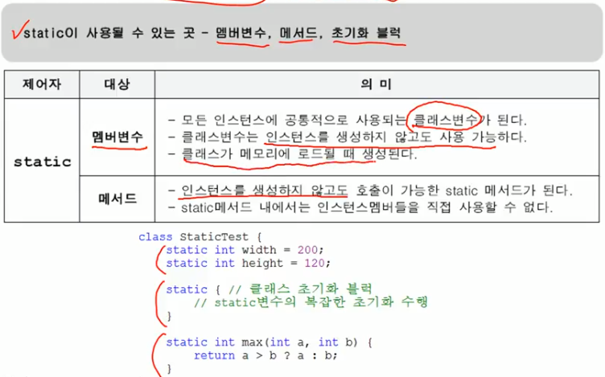


### 4.3 final - 마지막의, 변경될 수 없는

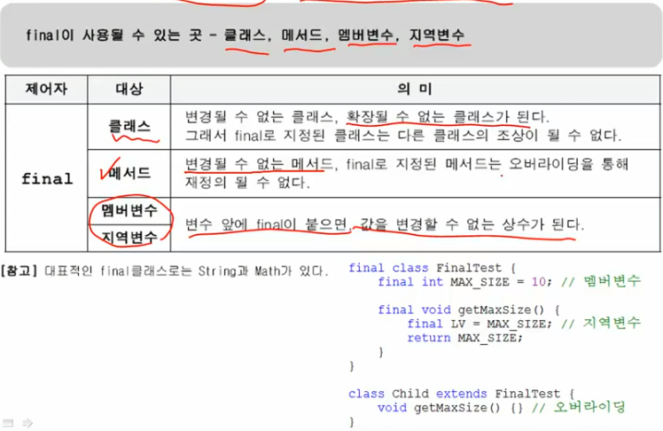


### 4.4 생성자를 이용한 final 멤버변수 초기화

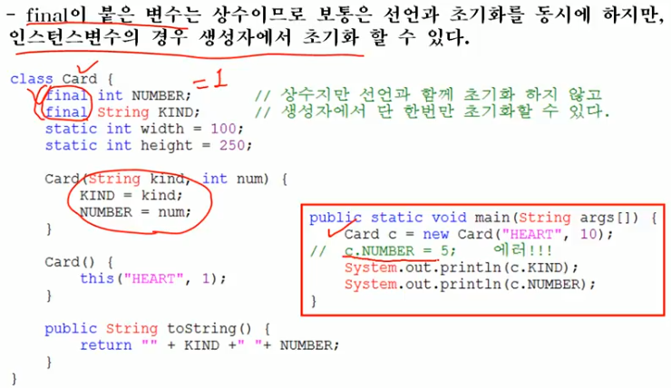


### 4.5 abstract - 추상의, 미완성의

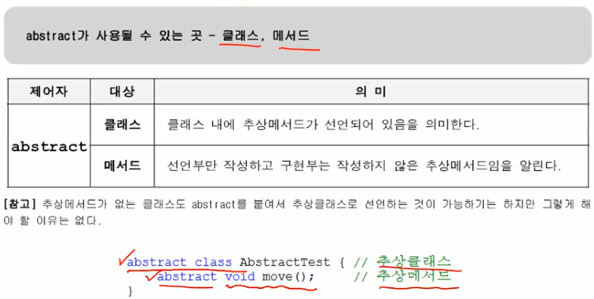


### 4.6 접근 제어자(access modifier)

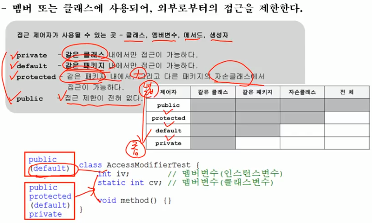


### 4.7 접근 제어자를 이용한 캡슐화

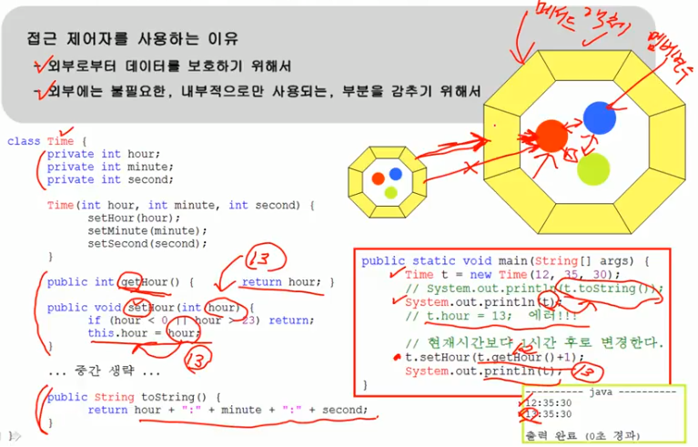


### 4.8 생성자의 접근 제어자

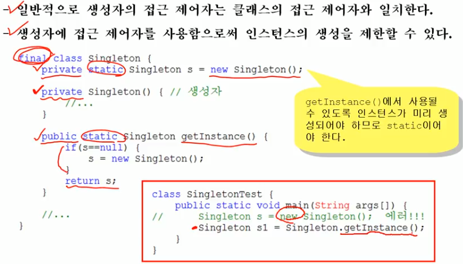


### 4.9 제어자의 조합

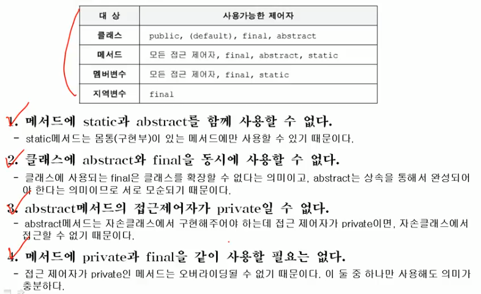


### 5.1 다형성이란?

- 여러 가지 형태를 가질 수 있는 능력

- 하나의 참조변수로 여러 타입의 객체를 참조할 수 있는 것

  즉, __조상타입의 참조변수로 자손타입의 객체를 다룰 수 있는 것이 다형성!__

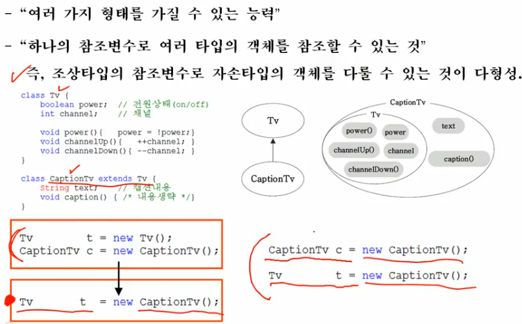


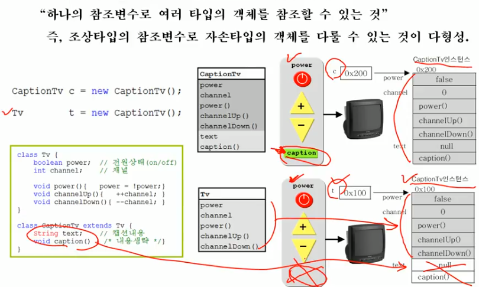

__반대로 자손타입의 참조변수로 조상타입의 인스턴스를 참조할 수는 없다.__


### 5.2 참조변수의 형변환

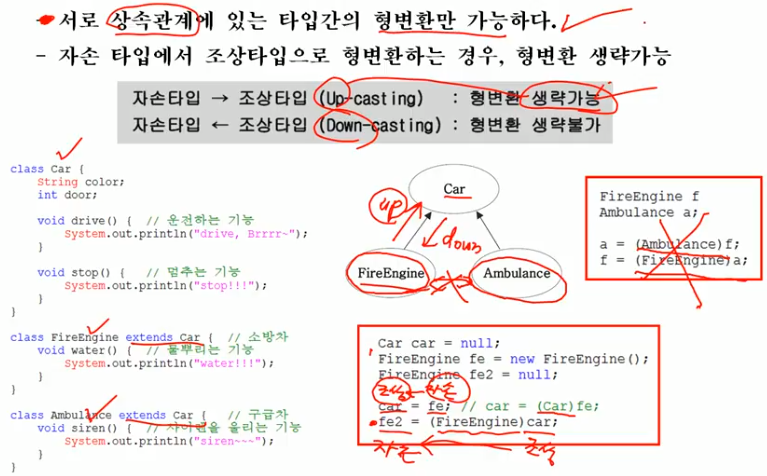

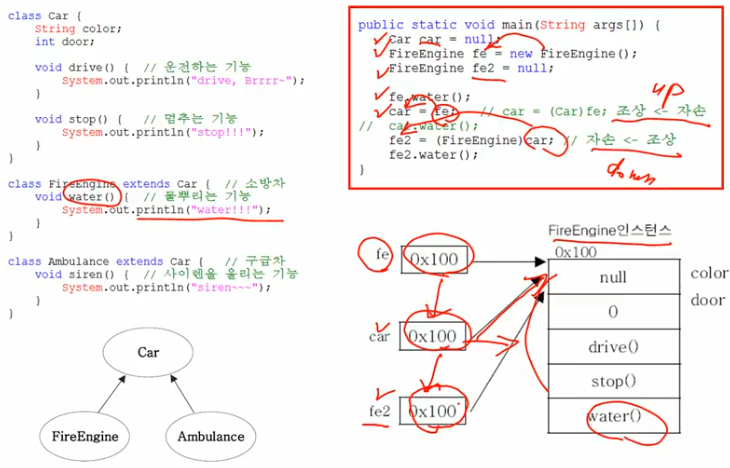


### 5.3 instanceof연산자

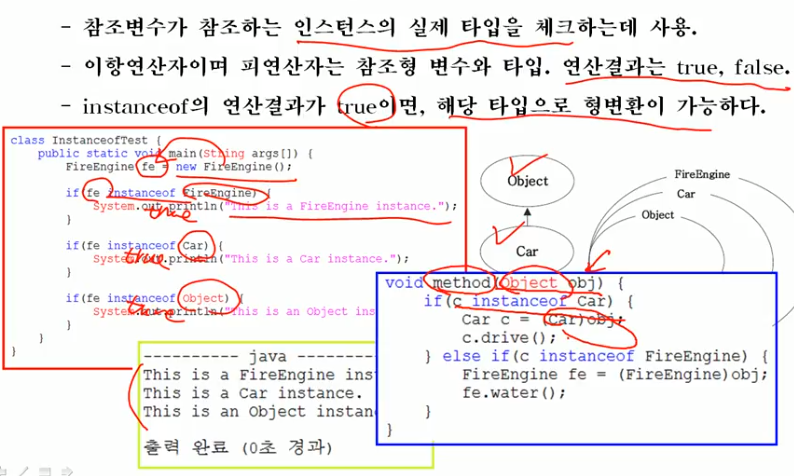


### 5.4 참조변수와 인스턴스변수의 연결

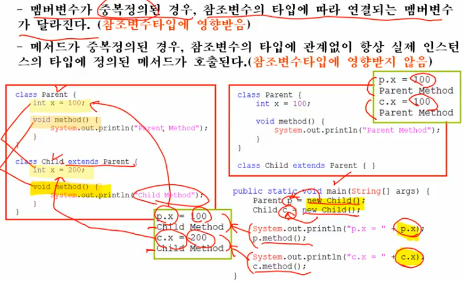


### 5.5 매개변수의 다항성

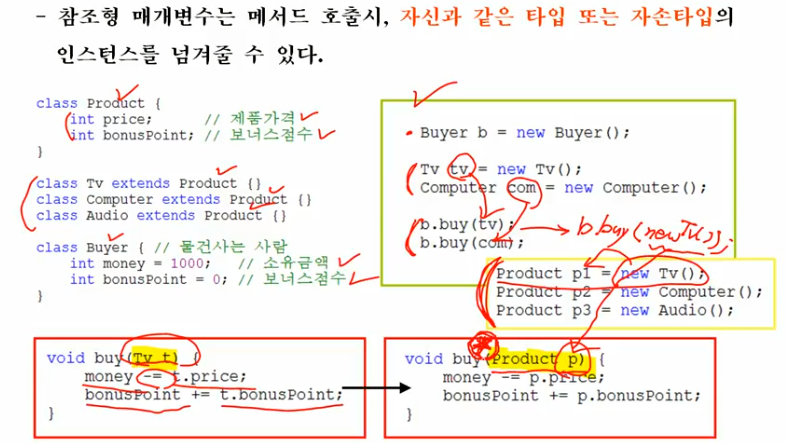


### 5.6 여러 종류의 객체를 하나의 배열로 다루기

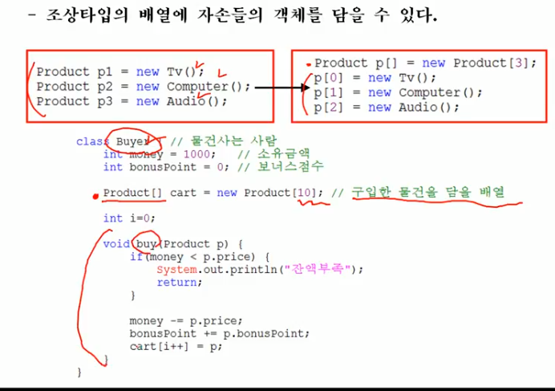

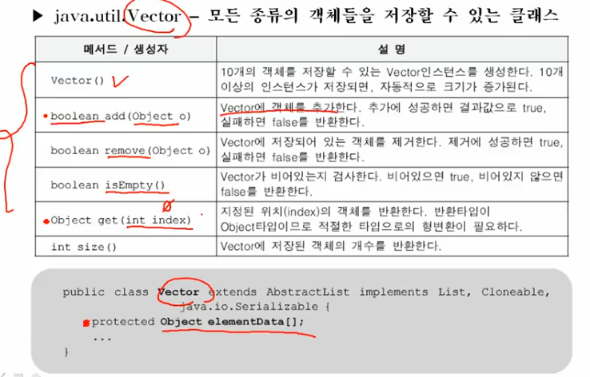

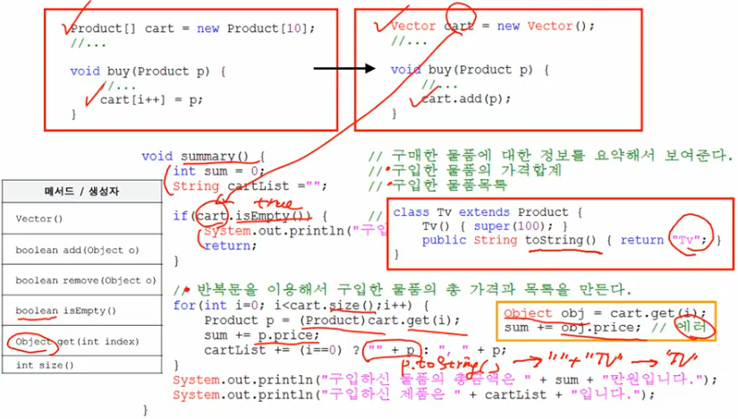

