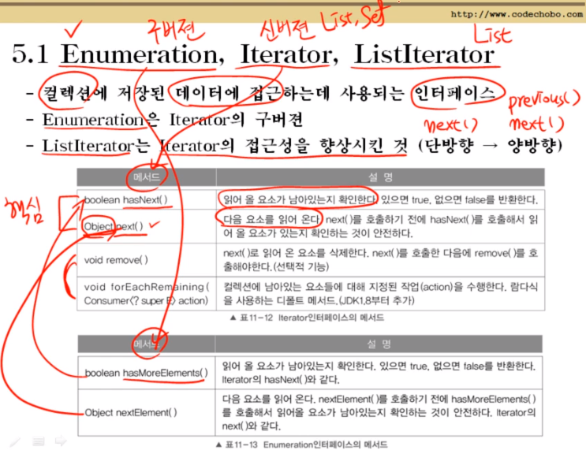
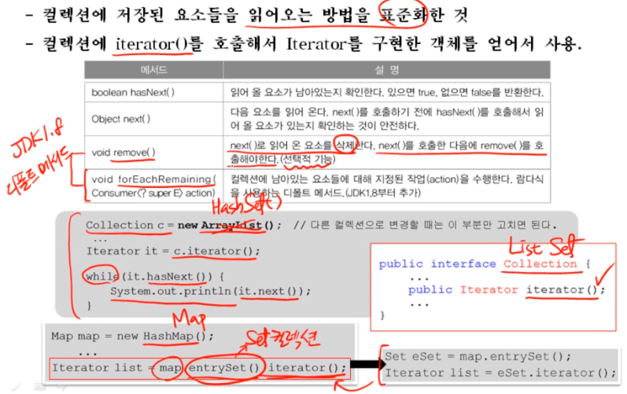
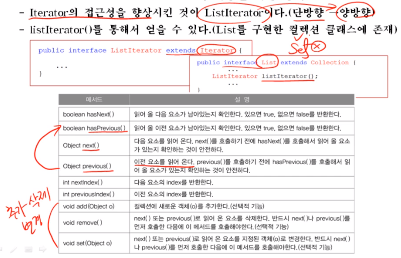

## Ch11-5 Iterator, Enumeration, Listlterator

### 5.1 Enumeration, Iterator, ListIterator

### 5.2 Iterator

- iterator로 list를 읽어오는 도중에 array를 추가, 수정, 삭제 하면 오류가 난다.

### 5.3 ListIterator - Iterator의 기능을 확장(상속)

